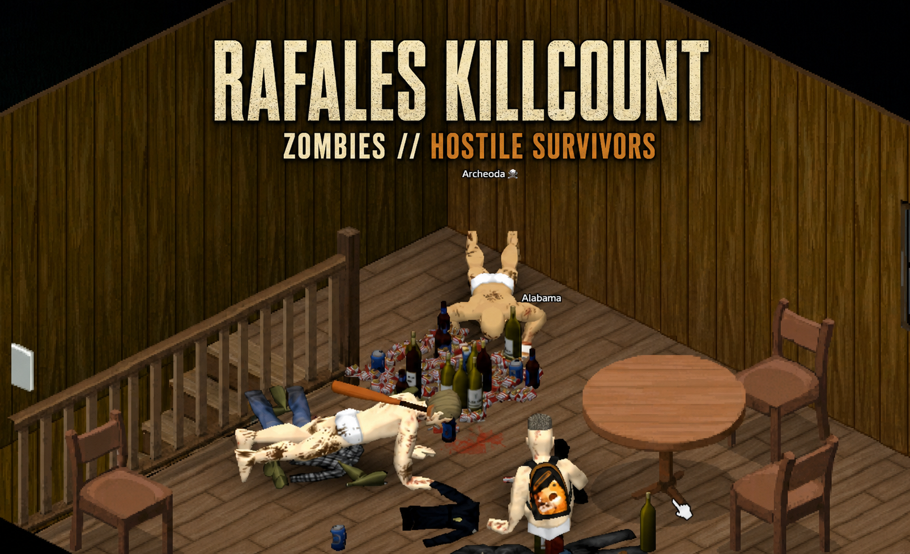

# Rafales Killcount

Track the story of your survivor in **Project Zomboid Build 42.20**.

Rafales Killcount separates the dead from the living threats of Knox County: regular zombie kills are tracked independently from hostile Knox Survivor kills, and both paths feed into their own progression ranks.



## Features

- Adds `Hostile Survivors Killed` to the character **Info** panel.
- Corrects the vanilla zombie total by excluding Knox Survivor zombie shells.
- Tracks only Knox Survivors who are hostile to the player at the moment of death.
- Adds two independent progression systems:
  - **Undead Rank:** Greenhorn → Hardened → Veteran → Reaper → Cold-Blooded
  - **Knox Threat Rank:** Unknown → Survivor → Hunter → Warlord → Legend
- Keeps the interface lightweight with no additional HUD required.
- Includes an optional rank gameplay effect for the `Cold-Blooded` milestone.
- Supports single-player and local-host play.

## Rank progression

### Undead Rank

| Zombie kills | Rank |
| ---: | --- |
| 0–299 | Greenhorn |
| 300–599 | Hardened |
| 600–899 | Veteran |
| 900–1,499 | Reaper |
| 1,500+ | Cold-Blooded |

At **Cold-Blooded**, the player's panic is repeatedly reset while a real zombie is within 12 tiles. Knox Survivors and other panic sources are not affected.

### Knox Threat Rank

| Hostile survivor kills | Rank |
| ---: | --- |
| 0–19 | Unknown |
| 20–29 | Survivor |
| 30–99 | Hunter |
| 100–149 | Warlord |
| 150+ | Legend |

## Requirements

- Project Zomboid **Build 42.20 Stable**
- [Knox Survivors](https://steamcommunity.com/sharedfiles/filedetails/?id=3749727604)

Knox Survivors is required because this mod uses its relationship data to identify hostile survivors.

## Installation

### Steam Workshop

Subscribe to the [Rafales Killcount Workshop item](https://steamcommunity.com/sharedfiles/filedetails/?id=3786908400) and enable it together with **Knox Survivors** before starting or loading a game.

### Manual / development install

Copy the `42.20` folder into your local Project Zomboid mod directory so the structure looks like this:

```text
RafalesKillcount/
└── 42.20/
    ├── mod.info
    └── media/
```

## Important notes

- Tracking begins after the mod is enabled. Earlier Knox Survivor shell kills cannot be separated from the existing vanilla zombie total.
- Direct player kills are detected through the victim's attacker/last-hit information. Vehicle, fire and other indirect kills may require additional in-game testing.
- The mod does not redistribute Knox Survivors files or code.

## Credits

Thanks to **.exe**, creator of Knox Survivors, for the support and permission to reference its API structure.

Created by [Rafale](https://github.com/dRafaleD).

## License

This project is provided for use with Project Zomboid. Please do not redistribute Knox Survivors code or assets.
